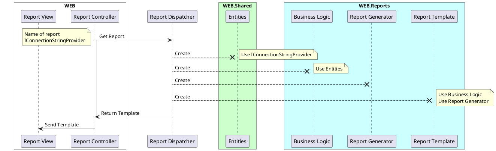

```plantuml
@startuml

skinparam ParticipantPadding 15
skinparam BoxPadding 36

box "WEB" #Transparent
  participant "Report View" as View
  participant "Report Controller" as Controller
end box

  participant "Report Dispatcher" as Dispatcher

box "WEB.Shared" #CCFFCC
  participant "Entities" as Entities
end box

box "WEB.Reports" #CCFFFF
  participant "Business Logic" as Logic
  participant "Report Generator" as Generator
  participant "Report Template" as Template
end box

Controller -> Dispatcher : Get Report
note left: Name of report\nIConnectionStringProvider

activate Controller

Dispatcher -->x Entities : Create
note right: Use IConnectionStringProvider

Dispatcher -->x Logic : Create
note right: Use Entities

Dispatcher -->x Generator : Create

Dispatcher -->x Template : Create
note right: Use Business Logic\nUse Report Generator

Dispatcher -> Controller : Return Template

deactivate  Controller

Controller -> View : Send Template

@enduml
```
