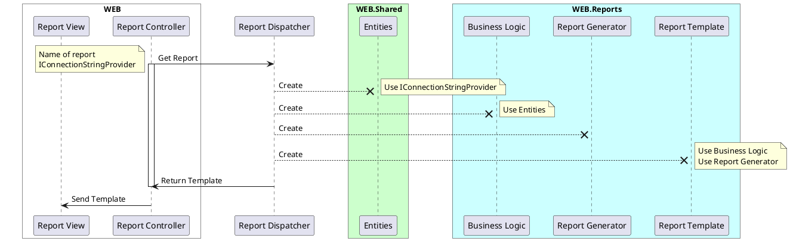
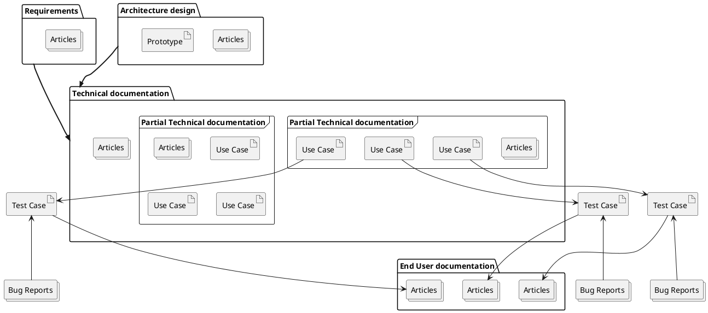
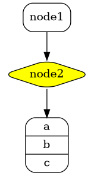
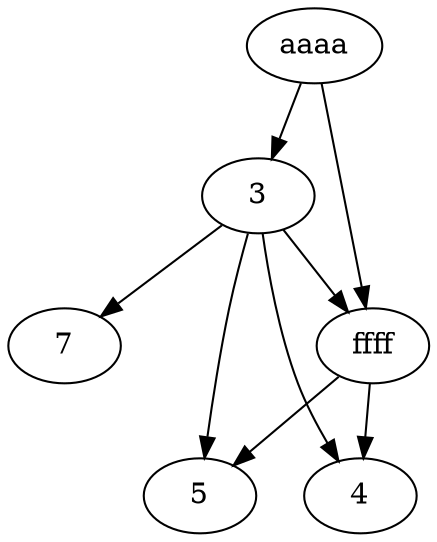
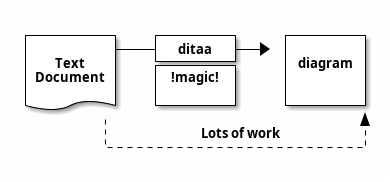

## Test Page
/
Here is a footnote reference,[^1] and another.[^longnote]

[^1]: Here is the footnote.

[^longnote]: Here's one with multiple blocks.

    Subsequent paragraphs are indented to show that they
belong to the previous footnote.

*[HTML]: Hyper Text Markup Language
*[W3C]:  World Wide Web Consortium
The HTML specification
is maintained by the W3C.

29^th^

H~2~0



ddd






dddddsdgf sf
d fg dg



dfgdfgdfg


dfgdfg




```plantuml
@startuml
ditaa(--no-shadows, scale=0.8)
/--------\   +-------+
|cAAA    +---+Version|
|  Data  |   |   V3  |
|  Base  |   |cRED{d}|
|     {s}|   +-------+
\---+----/
@enduml
```